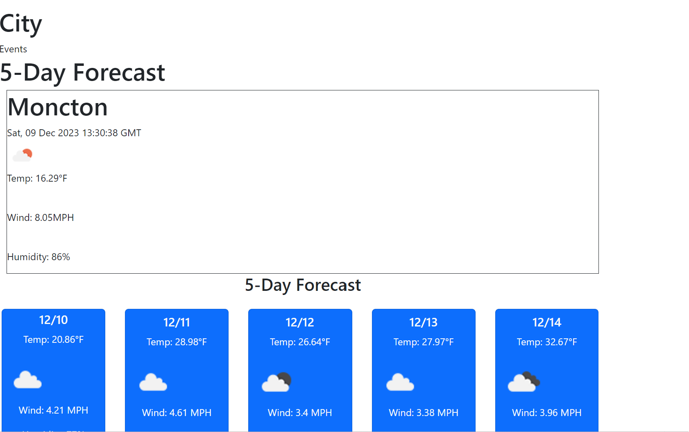

# weather-dashboard
## Description
AS A traveler
I WANT to see the weather outlook for multiple cities
SO THAT I can plan a trip accordingly

 ## Installation
N/A

 ## Usage
GIVEN a weather dashboard with form inputs
WHEN I search for a city
THEN I am presented with current and future conditions for that city and that city is added to the search history
WHEN I view current weather conditions for that city
THEN I am presented with the city name, the date, an icon representation of weather conditions, the temperature, the humidity, and the the wind speed
WHEN I view future weather conditions for that city
THEN I am presented with a 5-day forecast that displays the date, an icon representation of weather conditions, the temperature, the wind speed, and the humidity
WHEN I click on a city in the search history
THEN I am again presented with current and future conditions for that city

## Note

Initially, I encountered difficulties with this project, particularly with registering for the API key and developing the JavaScript component. To overcome this, I examined various weather dashboard projects created by others. By utilizing their code as a reference, I was able to navigate through this challenge more effectively. Learning through observation of others' work has been immensely helpful, especially as I continue to enhance my Java skills. Observing how others approach coding provides valuable insights, and it inspires me to innovate and create a unique version of the project.

## Credits
 https://github.com/mxu4321/Weather_Dashboard.git
 https://github.com/noahbtaylor/06-Server-Side-APIs.git

## License
Please refer to the LICENSE in the repo.

## Screenshot
  

## URL

https://github.com/AustinN789/weather-dashboard.git